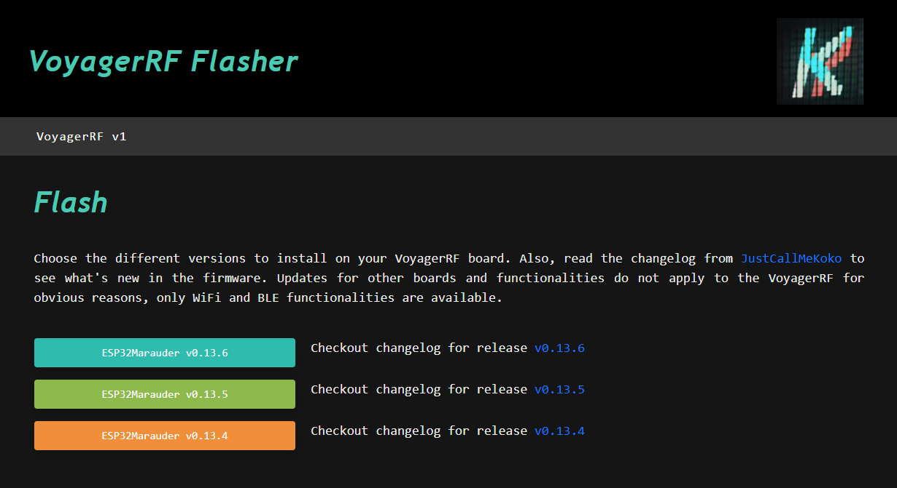

# VoyagerRF Flasher

This is a web application to flash/update your VoyagerRF board without installing Arduino IDE nor using the MicroSD card to perform the update. You just need a USB-C cable and a PC with Chrome. This project is mounter over [ESP32Marauder](https://github.com/justcallmekoko/ESP32Marauder) from [JustCallMeKoko](https://github.com/justcallmekoko), so do not forget to check it out! The guide and steps can be found in the actual [website](https://kashmir54.github.io/voyagerrf/). For any doubt or issue, do not hesitate to contact me or open an issue in this repo.

